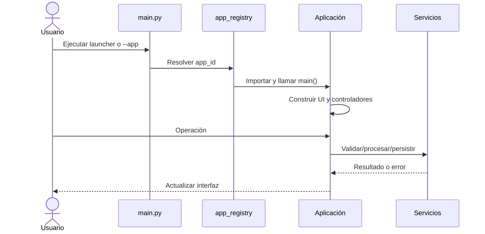

# Arquitectura de Suite Digital Fresnillo

Este documento describe la arquitectura técnica de Suite Digital Fresnillo 1.1.3, el flujo entre sus capas y la responsabilidad de cada archivo de código propio. Los recursos gráficos se describen por carpeta y LibreOffice se trata como una dependencia de terceros: sus miles de archivos internos no forman parte de la arquitectura desarrollada por el proyecto.

## 1. Vista general

La suite es una aplicación de escritorio para Windows construida con Python, Tkinter y CustomTkinter. Está formada por un lanzador y cuatro aplicaciones que pueden ejecutarse dentro de la distribución compilada o directamente desde el código fuente:

1. Test Data y versiones públicas.
2. Organigrama.
3. Directorio.
4. Conversor a PDF.

El punto de entrada no importa anticipadamente todas las interfaces. Consulta un registro central y carga el módulo solicitado bajo demanda. Esta separación reduce acoplamiento y permite ejecutar cada aplicación con `python main.py --app <id>`.

### Flujo de arranque

```text
main.py
  |
  +-- sin --app ----------------------> components.launcher.app.SuiteLauncher
  |                                      |
  |                                      +--> ApplicationRunner
  |                                             |
  |                                             +--> proceso del módulo elegido
  |
  +-- --app <id> --> app_registry --> App_*/main()
                                          |
                                          +--> ventana principal
                                                |
                                                +--> dominio/modelos
                                                +--> servicios
                                                +--> UI/controladores
```



### Reglas de dependencias

- La UI puede depender de configuración, modelos, dominio, servicios y componentes compartidos.
- Los servicios pueden depender de modelos/dominio y utilidades, pero no deben conocer widgets concretos.
- El dominio y los modelos contienen datos y reglas puras; no deben abrir ventanas ni mostrar mensajes.
- `components/shared` no depende de una aplicación concreta.
- Los módulos no deben importar directamente la UI de otro módulo.
- El código incluido en `App_ConversorPDF/vendor` es una dependencia externa y no debe importar código de la suite.

## 2. Capas y estado

### Configuración

Centraliza textos, rutas, formatos, extensiones, colores y tamaños. Evita duplicar constantes en controladores.

### Dominio y modelos

Representa el estado que puede guardarse y las transformaciones independientes de Tkinter: rectángulos de testado, nodos, conexiones, áreas y personas.

### Servicios

Gestiona archivos, persistencia, exportación, PDF, LibreOffice y procesos secundarios. Las escrituras importantes usan creación atómica para no dejar archivos parciales.

### Interfaz y controladores

Construye widgets, captura eventos y traduce acciones del usuario a operaciones de dominio o servicios. Las tareas largas se ejecutan fuera del hilo de Tkinter y comunican resultados mediante colas o `Future`.

### Persistencia

| Módulo | Formato | Contenido |
|---|---|---|
| Test Data | `.td` | Proyecto portátil con metadatos, rectángulos y PDF original. |
| Organigrama | `.og` | Documento JSON con nodos, conexiones, orientación y rutas manuales. |
| Directorio | `.dir` | Documento JSON con título, periodo, áreas y personal. |
| Conversor | Sin proyecto | Trabaja con archivos de entrada y resultados PDF. |

## 3. Archivos de raíz, construcción y publicación

| Archivo | Responsabilidad |
|---|---|
| `main.py` | Punto de entrada general. `main()` interpreta `--app`; `_run_launcher()` abre el dashboard cuando no se especifica módulo. |
| `pyproject.toml` | Metadatos de paquete, versión, versiones de Python, dependencias de ejecución/desarrollo y configuración de pytest y Ruff. |
| `convertidor.spec` | Receta de PyInstaller. Reúne módulos, assets, Tcl/Tk y LibreOffice; crea el EXE `SuiteFresnillo` e incorpora metadatos de versión. |
| `installer/SuiteFresnillo.iss` | Receta de Inno Setup. Define instalación x64, accesos directos, requisitos, desinstalación y nombre del instalador. |
| `.github/workflows/quality.yml` | Automatización de calidad del repositorio: instala dependencias, analiza y ejecuta pruebas. |
| `.gitignore` | Excluye cachés, entornos virtuales, temporales y artefactos de compilación. |
| `README.md` | Introducción, inicio rápido, comandos de calidad y enlaces a la documentación. |
| `docs/*.md` | Guías operativas y técnicas. Este archivo es la fuente de arquitectura; `QA.md` contiene pruebas manuales. |

`build/`, `dist/`, `installer_output/`, `tmp/`, `__pycache__/`, `.pytest_cache/` y `.ruff_cache/` son salidas generadas, no capas de la aplicación.

## 4. Componentes compartidos

### Registro, versión y estilos

| Archivo | Funciones y responsabilidad |
|---|---|
| `components/version.py` | Expone `VERSION` y `VERSION_TUPLE`, versión visible en ejecución. |
| `components/shared/app_registry.py` | `ApplicationDefinition` describe cada aplicación. `get_application()` resuelve un ID, `get_launcher_applications()` alimenta el dashboard y `run_application()` importa y ejecuta el paquete bajo demanda. |
| `components/styles/colors.py` | Tokens de color comunes. |
| `components/styles/spacing.py` | Tokens de separación, tamaños y geometría. |
| `components/styles/typography.py` | Familias y tamaños tipográficos compartidos. |
| `components/styles/styles.py` | Fachada de compatibilidad; `apply_ctk_style()` aplica apariencia y `styles` expone tokens antiguos. |
| `components/styles/__init__.py` | Exporta la API pública del paquete de estilos. |

### Infraestructura reutilizable

| Archivo | Funciones y responsabilidad |
|---|---|
| `components/shared/accessibility.py` | `enable_visible_focus()` y `enable_visible_focus_for()` añaden foco de teclado visible a árboles de widgets. |
| `components/shared/atomic_output.py` | `write_atomic_output()` genera primero un archivo temporal y lo reemplaza al terminar. `OutputCancelled` representa cancelación controlada. |
| `components/shared/confirmation.py` | `ask_save_discard_cancel()` normaliza confirmaciones de guardar, descartar o cancelar. |
| `components/shared/entries.py` | `VariablePlaceholderEntry` implementa placeholders sin alterar el valor real de una `StringVar`. |
| `components/shared/help_dialog.py` | Modelos de configuración y `show_help_dialog()`; construye, llena y centra diálogos de ayuda reutilizables. |
| `components/shared/images.py` | `load_pil_rgba()`, `crop_transparent()` y `load_ctk_image()` cargan, recortan y adaptan imágenes. |
| `components/shared/paths.py` | `is_frozen()`, `base_path()`, `resource_path()` y `build_path()` resuelven rutas en desarrollo y PyInstaller. |
| `components/shared/platform.py` | Secuencias de atajos y clic secundario dependientes del sistema operativo. |
| `components/shared/progress_overlay.py` | `ProgressOverlay.show()/hide()` bloquea visualmente una ventana durante una tarea larga. |
| `components/shared/project_lifecycle.py` | Escritura atómica JSON/texto/binario, huellas estables, archivos recientes y `ProjectLifecycle` para estado sucio, autosave y recuperación. |
| `components/shared/protected_storage.py` | `protect_bytes()` y `unprotect_bytes()` usan DPAPI de Windows para datos ligados al usuario. |
| `components/shared/shortcuts.py` | `bind_common_shortcuts()` instala Nuevo, Abrir, Guardar, Deshacer y Rehacer sin interferir con entradas de texto. |
| `components/shared/tooltip.py` | `Tooltip` controla temporización, posición, topmost y cierre de ayudas flotantes. |
| `components/shared/topbar.py` | `TopbarStyle`, `TopbarButton` y `build_topbar()` construyen barras superiores homogéneas. |
| `components/shared/windowing.py` | Centrado, preparación, maximización y revelado sin parpadeo de ventanas. |
| `components/shared/__init__.py` | Marca el paquete y mantiene exportaciones compartidas estables. |

## 5. Launcher

| Archivo | Funciones y responsabilidad |
|---|---|
| `components/launcher/app.py` | `SuiteLauncher` es la ventana raíz; `_build_layout()` compone cabecera, cuadrícula y pie. |
| `components/launcher/config.py` | Título con versión, subtítulo, dimensiones, banner, aviso legal y configuración de aplicaciones. |
| `components/launcher/services/app_runner.py` | `ApplicationRunner.launch()` evita instancias duplicadas, diferencia desarrollo/compilado, oculta el launcher y vigila el proceso hijo. |
| `components/launcher/ui/app_card.py` | `ApplicationCard` representa un módulo y gestiona hover, clic, disponibilidad y foco. |
| `components/launcher/ui/app_grid.py` | `ApplicationGrid` crea tarjetas y recalcula columnas según el ancho. |
| `components/launcher/ui/header.py` | `LauncherHeader` carga y redimensiona el banner. |
| `components/launcher/ui/footer.py` | `LauncherFooter` presenta información institucional y ajusta el ancho del aviso. |
| `components/launcher/ui/image_loader.py` | `ImageLoader` abre imágenes y crea iconos con caché. |
| `components/launcher/ui/scrollable_frame.py` | Canvas desplazable con sincronización de región, ancho y rueda del ratón. |
| `components/launcher/ui/styles.py` | `configure_launcher_styles()` configura estilos ttk usados por el dashboard. |
| `components/launcher/__init__.py`, `services/__init__.py`, `ui/__init__.py` | Declaran paquetes y concentran exportaciones públicas del launcher. |

## 6. Test Data y versiones públicas

### Flujo principal

```text
TestDataGeneratorApp
  +--> layout/* ------------------------> widgets Tk
  +--> NavigationController -----------> PDFManager.render_current_page()
  +--> canvas_redactions --------------> RectangleData + historial
  +--> ExportController ---------------> RedactionPdfExporter
  |                                       +--> redacciones
  |                                       +--> etiquetas
  |                                       +--> portada/resumen
  |                                       +--> marca de agua
  |                                       +--> optimización
  +--> project_persistence ------------> archivo .td
```

### Entrada y configuración

| Archivo | Funciones y responsabilidad |
|---|---|
| `App_TestData/__init__.py` | Expone `TestDataGeneratorApp` y `main` al registro central. |
| `App_TestData/__main__.py` | Permite ejecutar el paquete con `python -m App_TestData`. |
| `App_TestData/application.py` | `main()` crea la aplicación canónica e inicia `mainloop()`. |
| `App_TestData/config/settings.py` | Rutas de assets, zoom, tamaños, colores y constantes de PDF/UI. |
| `App_TestData/config/ui_strings.py` | Textos en español de botones, mensajes, títulos, ayuda y diálogos. |
| `App_TestData/config/__init__.py` | Reexporta la configuración pública. |
| `App_TestData/data/catalogue_data.py` | `build_catalogue_items()` y `build_catalogue_categories()` preparan el catálogo legal para la UI. |
| `App_TestData/data/__init__.py` | Expone los datos de catálogo. |

### Dominio

| Archivo | Funciones y responsabilidad |
|---|---|
| `domain/document_state.py` | `RectangleData` modela coordenadas, página y concepto. `DocumentState` agrupa PDF, zoom, selección e historial; `reset_for_new_job()` limpia el trabajo. |
| `domain/legal_text.py` | `build_censorship_text()` convierte metadatos de un rectángulo en el texto legal mostrado/exportado, incluido el texto Personalizado. |
| `domain/redaction_editing.py` | Reglas puras para eliminar, deshacer/rehacer, ordenar rectángulos y construir metadatos visibles. |
| `domain/redaction_history.py` | Crea acciones y aplica/invierte altas, bajas y modificaciones del historial. |
| `domain/__init__.py` | Expone modelos y reglas de testado sin dependencias de UI. |

### Servicios PDF y persistencia

| Archivo | Funciones y responsabilidad |
|---|---|
| `services/pdf_service.py` | `PDFManager` abre/renderiza PDFs, transforma coordenadas entre canvas/PDF considerando rotación y delega la exportación. `PdfUiCallbacks` define el contrato con la UI. |
| `services/redaction_exporter.py` | `RedactionPdfExporter.export()` orquesta copia atómica, redacciones, etiquetas, numeración final, reescalado de imágenes y guardado optimizado según calidad. |
| `services/summary_pages.py` | `SummaryPagesWriter` genera páginas de fundamento; construye líneas reservadas, confidenciales, otras leyes y personalizadas. `apply_watermark()` reutiliza la marca de agua optimizada. |
| `services/committee_cover.py` | `CommitteeCoverWriter` crea portada y tabla del documento para Comité. |
| `services/pdf_fonts.py` | Selección de fuente y medición de texto compatible con PyMuPDF. |
| `services/pdf_footer.py` | `add_institutional_footer()` agrega pie institucional a cada página final. |
| `services/project_persistence.py` | Hash, serialización y validación de `.td`; guarda proyectos portátiles, abre formato actual/legado y gestiona la vida del PDF temporal mediante `LoadedProject`. |
| `services/__init__.py` | Reexporta servicios admitidos por la aplicación. |

### UI y controladores

| Archivo | Funciones y responsabilidad |
|---|---|
| `ui/app.py` | Fachada pública de la clase principal. |
| `ui/application_controller.py` | `TestDataGeneratorApp` compone dependencias, estado, callbacks y ciclo de proyecto; adapta `PDFManager` a widgets, coordina apertura/guardado/recuperación y delega navegación, rectángulos y exportación. |
| `ui/controllers/navigation.py` | Cambio de página, entrada directa, zoom y sincronización de controles. |
| `ui/controllers/rectangle_actions.py` | Acciones deshacer/rehacer/eliminar y sincronización de selección/botón. |
| `ui/controllers/export.py` | Abre el diálogo de exportación, ejecuta el exportador en segundo plano, cancela, bloquea controles y procesa resultados. |
| `ui/controllers/__init__.py` | API pública de controladores. |
| `ui/interactions/canvas_redactions.py` | Eventos de ratón para crear, seleccionar, mover, redimensionar, editar y cancelar rectángulos; hit testing, cursores e historial. |
| `ui/interactions/scroll.py` | Traduce rueda y modificadores en scroll o zoom. |
| `ui/interactions/__init__.py` | API pública de interacciones. |
| `ui/dialogs/concept_dialog.py` | `ConceptDialog` construye pestañas General, Clasificación, Otro fundamento y Personalizado; valida, restaura datos e historial y produce metadatos aceptados. |
| `ui/dialogs/export_dialog.py` | `ExportDialog` selecciona documento estándar/comité y calidad de salida. |
| `ui/dialogs/catalogue_dialog.py` | Presenta catálogo legal por secciones y controla desplazamiento. |
| `ui/dialogs/help_dialog.py` | Contenido y centrado de ayuda del módulo. |
| `ui/dialogs/__init__.py` | Exporta diálogos públicos. |
| `ui/layout/main_layout.py` | `build_main_layout()` compone toda la ventana. |
| `ui/layout/header_bar.py` | Construye cabecera institucional. |
| `ui/layout/top_toolbar.py` | Menú de archivo, acciones de documento y botones superiores. |
| `ui/layout/content_view.py` | Canvas central, barras de desplazamiento y contenedor del PDF. |
| `ui/layout/navigation_bar.py` | Controles de página y zoom. |
| `ui/layout/__init__.py` | API pública de constructores de layout. |
| `ui/widgets/factory.py` | Fuentes, entradas y fábricas de botones de texto/icono. |
| `ui/widgets/__init__.py` | Exporta las fábricas reutilizables. |

### Utilidades puras

| Archivo | Funciones y responsabilidad |
|---|---|
| `utils/navigation.py` | Validación, conversión y avance/retroceso de índices de página. |
| `utils/validation.py` | Parseo de enteros, límites y pares acotados. |
| `utils/zoom.py` | Siguiente zoom, zoom automático y porcentaje visible. |
| `utils/__init__.py` | Reexporta utilidades puras. |

## 7. Organigrama

### Flujo principal

```text
MainFrame
  +--> OrgGridCanvas
  |     +--> controladores de nodos/conexiones/interacción/viewport
  |     +--> RenderingEngine
  |     +--> ManhattanRouter
  +--> WorkspaceProjectMixin
        +--> PersistenceManager (.og)
        +--> PdfOrgChartExporter
        +--> image_exporter
        +--> DocumentHistory + ProjectLifecycle
```

### Entrada, configuración y modelos

| Archivo | Funciones y responsabilidad |
|---|---|
| `App_Organigrama/__init__.py` | Expone la aplicación y `main`. |
| `App_Organigrama/__main__.py` | Entrada para `python -m App_Organigrama`. |
| `App_Organigrama/application.py` | `AppOrganigrama` es la clase canónica; `main()` inicia el bucle. |
| `config/assets.py` | Rutas de logos, cursores, undo/redo, orientación y marca de agua. |
| `config/__init__.py` | API pública de configuración. |
| `models/document.py` | `OrgNode`, `Connection` y `OrgGridDocument`; índices, altas/cambios/bajas, rutas manuales, serialización y límites. |
| `models/history.py` | `DocumentHistory` mantiene snapshots, undo/redo, punto guardado y estado sucio. |
| `models/__init__.py` | Exporta los modelos principales. |

### Renderizado, rutas y exportación

| Archivo | Funciones y responsabilidad |
|---|---|
| `rendering/engine.py` | Modelos de layout y `RenderingEngine`: orientación, cuadrícula, estilos, cajas, ajuste/envoltura de texto y límites del documento. |
| `rendering/palette.py` | `HierarchyStyle` e `is_inverse_hierarchy()` definen colores y contraste por jerarquía. |
| `rendering/connection_arrows.py` | Geometría del triángulo de flecha y aplanado de puntos. |
| `rendering/__init__.py` | API pública de renderizado. |
| `routing/manhattan_router.py` | `ManhattanRouter` calcula rutas ortogonales con A*, obstáculos, puntos de tráfico, fallback y simplificación. |
| `routing/manual_routes.py` | Construye y edita segmentos/rincones manuales, normaliza puntos y detecta colisiones. |
| `routing/__init__.py` | API pública de enrutamiento. |
| `exporters/pdf.py` | `PdfOrgChartExporter` transforma mundo a PDF, crea páginas, fondos, cabecera, conexiones, nodos, logos y tipografía. |
| `exporters/__init__.py` | Expone el exportador PDF. |
| `services/persistence.py` | `PersistenceManager` guarda, carga y migra documentos `.og`. |
| `services/image_exporter.py` | `export_pdf_as_image()` rasteriza la exportación PDF al formato de imagen elegido. |
| `services/__init__.py` | API pública de servicios. |

### Canvas e interacción

| Archivo | Funciones y responsabilidad |
|---|---|
| `ui/canvas.py` | `OrgGridCanvas` compone todos los mixins/controladores, mantiene documento y rutas calculadas y coordina redraw total/overlays. |
| `ui/canvas_state.py` | Máquina de estados `InteractionMode`/`CanvasInteractionState` para selección, arrastre, paneo y conexión. |
| `ui/canvas_interaction_controller.py` | Despacha eventos de puntero/teclado, selección, autoscroll, contexto, cursor y notificaciones de cambios. |
| `ui/canvas_node_controller.py` | Crear/editar/duplicar/eliminar nodos, menús, hit testing, layouts e imágenes de nodo. |
| `ui/canvas_connection_controller.py` | Crear conexiones, elegir puertos, editar rutas manuales, detectar conexiones y validar dirección jerárquica. |
| `ui/canvas_viewport_controller.py` | Zoom, scroll, paneo, movimiento de nodos, enfoque y ajuste del documento. |
| `ui/canvas_drawing.py` | Dibuja cuadrícula, conexiones, previews, rutas manuales, nodos, puertos y elementos fantasma. |
| `ui/canvas_selection.py` | Overlays de selección para nodos y conexiones. |
| `ui/canvas_hit_testing.py` | Distancias y búsquedas independientes del toolkit para entidades, segmentos, dobleces y puertos. |
| `ui/canvas_viewport.py` | Transformaciones puras mundo/pantalla/cuadrícula y proyección de layouts. |
| `ui/canvas_visibility.py` | Culling: determina si cajas o líneas intersectan el viewport. |
| `ui/canvas_image_cache.py` | Carga RGBA y caché de imágenes redimensionadas. |
| `ui/canvas_shapes.py` | `create_rounded_rectangle()` dibuja cajas redondeadas en Tk Canvas. |

### Ventana y diálogos

| Archivo | Funciones y responsabilidad |
|---|---|
| `ui/app.py` | `OrgChartApplication` configura la ventana raíz y contiene `MainFrame`. |
| `ui/main_frame.py` | Fachada pública compatible de `MainFrame` y `filedialog`. |
| `ui/workspace_controller.py` | Construcción de menús, topbar, metadatos, toolbar, canvas, pie y enlaces de historial; coordina estado visual. |
| `ui/workspace_project.py` | `WorkspaceProjectMixin` gestiona nuevo/abrir/guardar, exportación, tareas de fondo, carga, undo/redo, estado sucio, recientes, autosave y cierre. |
| `ui/modals/node_editor.py` | Editor de nodo: área, cargo, personas, color, logo y validación. |
| `ui/modals/orientation.py` | Selección visual de orientación y centrado del modal. |
| `ui/modals/help.py` | Contenido de ayuda del diseñador. |
| `ui/modals/__init__.py` | Exporta modales públicos. |
| `ui/theme.py` | Tokens locales, `apply_theme()` y `make_font()`. |
| `ui/__init__.py` | Expone `OrgChartApplication`. |

### Muestras

| Archivo | Funciones y responsabilidad |
|---|---|
| `samples/generate_performance_sample.py` | Genera de forma determinista un organigrama grande para medir interacción/exportación. |
| `samples/README.md` | Explica el uso de la muestra. |
| `samples/__init__.py` | Marca el paquete de muestras. |
| `samples/*.og` | Datos de prueba manual; no contienen lógica. |

## 8. Directorio

### Entrada, configuración y datos

| Archivo | Funciones y responsabilidad |
|---|---|
| `App_Directorio/__init__.py` | Expone aplicación y `main`. |
| `App_Directorio/__main__.py` | Entrada para `python -m App_Directorio`. |
| `App_Directorio/application.py` | `AppDirectorio` y `main()` son la entrada canónica. |
| `config/assets.py` | Rutas de logo e iconos de filas/áreas. |
| `config/strings.py` | Textos de interfaz y ayuda. |
| `config/__init__.py` | Reexporta configuración. |
| `models/directory.py` | Dataclasses `PersonReportRow`, `AreaReportData` y `DirectoryReportData`. |
| `models/__init__.py` | Expone los modelos. |

### Formulario y ventana

| Archivo | Funciones y responsabilidad |
|---|---|
| `ui/app.py` | `DirectoryApplication` configura la ventana raíz. |
| `ui/main_frame.py` | `DirectoryMainFrame` coordina formulario, menú, exportación asíncrona, preview, persistencia, historial, autosave, recientes y cierre. |
| `ui/forms/directory_editor.py` | `DirectoryFormFrame` compone metadatos y áreas; agrega, elimina, reordena y transfiere personas; produce/recibe `DirectoryReportData` y valida resumen. |
| `ui/forms/area_section.py` | `AreaSection` administra una sola área expandible, su modelo de personal y la ventana virtual de filas. |
| `ui/forms/personnel_row.py` | `PersonnelRow` enlaza widgets reutilizados con una persona, valida fecha/correo y reporta cambios/reposición. |
| `ui/forms/field_helpers.py` | Crea personas vacías, detecta contenido, fuerza mayúsculas y valida posiciones positivas. |
| `ui/forms/virtualization.py` | `virtual_window()` y `start_from_fraction()` calculan qué filas materializar y la fracción del scrollbar sin Tkinter. |
| `ui/forms/directory_form.py` | Fachada pública compatible para formulario, área, fila y `bind_uppercase`. |
| `ui/forms/__init__.py` | Expone `DirectoryFormFrame`. |
| `ui/accessibility.py` | Adaptadores locales de foco visible. |
| `ui/widgets/icon_button.py` | Carga pares de iconos y `HoverIconButton` alterna imágenes normal/hover. |
| `ui/widgets/__init__.py` | Exporta widgets e iconos. |
| `ui/dialogs/help.py` | Ayuda del módulo. |
| `ui/dialogs/__init__.py` | Exporta el diálogo. |
| `ui/theme.py` | Tema y fuentes del Directorio. |
| `ui/__init__.py` | Expone `DirectoryApplication`. |

### Servicios y utilidades

| Archivo | Funciones y responsabilidad |
|---|---|
| `services/persistence.py` | `DirectoryPersistenceManager` guarda/carga `.dir`, valida versión y reconstruye modelos. |
| `services/pdf_exporter.py` | `DirectoryPdfExporter` crea cabecera, calcula ajuste, arma tabla, carga logos y escribe PDF atómicamente. |
| `services/__init__.py` | API pública de servicios. |
| `utils/validation.py` | Prefijo válido durante escritura y validación final de fechas `dd/mm/aaaa`. |
| `utils/images.py` | `crop_transparent_padding()` elimina margen transparente de imágenes. |
| `utils/__init__.py` | Reexporta utilidades. |
| `samples/generate_large_directory_sample.py` | Construye un `.dir` determinista de gran tamaño para QA de virtualización. |
| `samples/*.dir` | Proyectos de rendimiento, sin lógica ejecutable. |

## 9. Conversor a PDF

### Flujo principal

```text
PdfConverterMainFrame
  +--> WorkspaceLayoutMixin
  +--> ConversionWorkflowMixin --> output_planner --> PdfConverter
  |                                                 +--> imagen/PDF directo
  |                                                 +--> LibreOffice
  |                                                 +--> SpreadsheetPdfExporter
  +--> MergeWorkflowMixin ------> PdfMerger
  +--> BackgroundTaskMixin -----> hilo + cola + cancelación
```

### Entrada y configuración

| Archivo | Funciones y responsabilidad |
|---|---|
| `App_ConversorPDF/__init__.py` | Expone aplicación y `main`; prepara la ruta del proveedor Python incluido cuando procede. |
| `App_ConversorPDF/__main__.py` | Entrada para `python -m App_ConversorPDF`. |
| `App_ConversorPDF/application.py` | `AppConversorPDF` y `main()` son la entrada canónica. |
| `config/__init__.py` | Extensiones admitidas, rutas de iconos, textos y constantes del conversor. |

### Servicios

| Archivo | Funciones y responsabilidad |
|---|---|
| `services/output_planner.py` | Modelos `SourceItem`/`PlannedOutput`; normaliza/expande selecciones, sanea nombres y construye el plan de PDFs antes de convertir. |
| `services/converter.py` | `ConversionRequest` describe una conversión. `PdfConverter` valida entrada/salida y elige estrategia para imagen, PDF, hoja o documento Office; interpreta rangos y evita colisiones de nombres. |
| `services/libreoffice.py` | Busca `soffice.exe` en desarrollo, distribución congelada y sistema; `require_soffice_path()` falla con mensaje útil si no existe. |
| `services/process_control.py` | Ejecuta subprocesos cancelables y termina el árbol completo para no dejar LibreOffice en segundo plano. |
| `services/spreadsheet_exporter.py` | `SpreadsheetPdfExporter` inicia LibreOffice/UNO en puerto libre y exporta pestañas seleccionadas mediante un worker. |
| `services/pdf_merger.py` | `PdfMerger.merge()` valida entradas y escribe la combinación de manera atómica. |

### UI

| Archivo | Funciones y responsabilidad |
|---|---|
| `ui/app.py` | `PdfConverterApplication` configura ventana y soporte drag-and-drop. |
| `ui/main_frame.py` | Fachada pública de `PdfConverterMainFrame`. |
| `ui/conversion_workspace.py` | Coordinador principal: crea servicios/estado, compone mixins, instala atajos y controla cierre/destrucción. |
| `ui/workspace_models.py` | `SourceFileItem` mantiene ruta, selección, opción de separar y nombres planeados por archivo. |
| `ui/workspace_layout.py` | `WorkspaceLayoutMixin` construye topbar, cabecera, modos Convertir/Combinar, paneles de carga/descarga y overlay. |
| `ui/conversion_workflow.py` | Selección y drag-and-drop, listado, rangos/hojas, salida individual/lote, separación, reportes y sincronización de botones. |
| `ui/merge_workflow.py` | Selección, alta/baja, render, reordenamiento por arrastre, indicador de destino y guardado de PDF combinado. |
| `ui/background_tasks.py` | Hilo de conversión, cola de eventos, overlay, cancelación y finalización éxito/error. |
| `ui/dialogs/help.py` | Ayuda del Conversor. |
| `ui/dialogs/__init__.py` | Expone el diálogo de ayuda. |
| `ui/theme.py` | Tema, colores y fuentes del módulo. |
| `ui/__init__.py` | Expone `PdfConverterApplication`. |

### Dependencias incluidas

| Ruta | Responsabilidad |
|---|---|
| `App_ConversorPDF/vendor/LibreOffice/` | Distribución completa de LibreOffice usada para Office/Calc/Impress. Es código de terceros y se copia sin reinterpretar su estructura. |
| `App_ConversorPDF/vendor/python/tkinterdnd2/` | Proveedor de drag-and-drop empaquetado para asegurar disponibilidad en el EXE. |
| `App_ConversorPDF/assets/` | Iconos del flujo de carga, descarga, separación y marca visual. |

## 10. Recursos gráficos

- `components/assets/`: icono de la suite, banner e iconos de tarjetas.
- `App_TestData/assets/`: logos, marca de agua y acciones del editor.
- `App_Organigrama/assets/`: logos, orientación, cursor, undo/redo y marca de agua.
- `App_Directorio/assets/`: logo y acciones de áreas/personas.
- `App_ConversorPDF/assets/`: carga, descarga, separación y branding.

Los módulos acceden a recursos mediante rutas de configuración y `components.shared.paths`; no deben construir rutas absolutas.

## 11. Pruebas

`tests/` contiene pruebas unitarias y de regresión. Cada `test_*.py` se concentra en la unidad indicada por su nombre: persistencia, navegación, rutas, canvas, historial, exportadores, cancelación, escritura atómica, virtualización, testados personalizados y optimización PDF.

Las pruebas de geometría, modelos y servicios evitan crear ventanas cuando es posible. Las regresiones de UI usan objetos mínimos o mocks para verificar coordinación sin depender de interacción manual. `docs/QA.md` cubre los escenarios que requieren inspección visual o una máquina limpia.

## 12. Decisiones de diseño y mantenimiento

- Los archivos `__init__.py` son fachadas de paquete, aunque sean cortos; no se eliminan porque estabilizan importaciones.
- Los archivos `__main__.py` son entradas estándar de Python, no duplicados innecesarios.
- Los mixins de UI separan responsabilidades, pero solo operan sobre estado creado por su coordinador; no deben instanciar servicios globales.
- Los modelos serializables deben conservar compatibilidad o incluir migración al cambiar esquema.
- Toda exportación debe evitar sobrescrituras parciales y responder a cancelación cuando ejecute tareas largas.
- Las funciones puras de geometría, validación y planificación deben permanecer fuera de widgets para facilitar pruebas.
- Un archivo pequeño se conserva cuando representa una frontera clara de API, configuración o una regla reutilizable; se unifica solo si duplica responsabilidad.

## 13. Documentos relacionados

- [API_REFERENCE.md](API_REFERENCE.md): contratos reutilizables.
- [DATA_FORMATS.md](DATA_FORMATS.md): esquemas y migraciones.
- [EXTENDING.md](EXTENDING.md): procedimiento para ampliar módulos.
- [PERFORMANCE.md](PERFORMANCE.md): decisiones y medición de rendimiento.
- [SECURITY_AND_PRIVACY.md](SECURITY_AND_PRIVACY.md): controles y límites.
